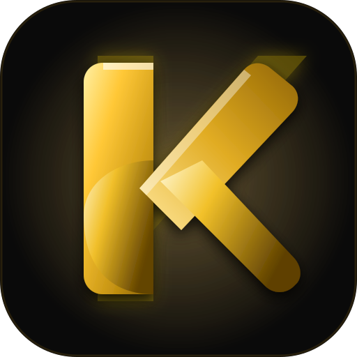

<div align="center">

<a href="#">
  
</a>

# Koda Reader

### High-Performance Desktop Comic & Manga Reader
A sleek, modern, and memory-efficient **CBZ / ZIP Comic & Manga Reader** built with React, TypeScript, Tailwind CSS, Vite, and Electron.

[](https://www.electronjs.org/)
[](https://react.dev/)
[](https://www.typescriptlang.org/)
[](https://vitejs.dev/)
[](./LICENSE)

</div>

---

## Features

<div align="left">

* **Continuous Chapter Reading**: Automatically scans and streams all `.cbz` / `.zip` archives in a directory with instant seamless transitions between chapters (Mihon/Tachiyomi style).
* **Multiple Viewer Modes**:
  * **Paged Mode**: Single page or dual-page spread with optional cover page isolation (`First page is Cover`).
  * **Webtoon Mode**: Smooth, continuous vertical scrolling with fine-grained seeking.
  * **Auto-Spread**: Automatically pairs pages side-by-side on wide displays (>1100px).
* **Manga & Comic Directions**: Instant switching between **Left-to-Right (LTR)** and **Right-to-Left (RTL)** reading directions.
* **Stream-Based Memory Architecture**: Integrated LRU memory purging and on-demand zip file extraction for ultra-low RAM usage even with high-resolution 4K archives.
* **Built-in CBZ Packager**: Convert loose image folders directly into compressed `.cbz` comic archives from within the app.
* **Zen Auto-Hide Controls**: Distraction-free reading view that auto-hides navigation controls during reading and smoothly reveals them on mouse movement.
* **Native Hotkeys & Touch Gestures**: Complete keyboard control (Arrow keys, `J`/`K`, Space, `Cmd+O`, `Cmd+\`, `M` for Manga mode, `F` for Fullscreen).

</div>

---

## Getting Started

### Prerequisites

Ensure you have the following installed on your system:
- **Node.js**: `v20.0.0` or higher
- **npm**: `v10.0.0` or higher

### Installation

Execute each command one by one in your terminal:

1. Clone the repository:
```bash
git clone https://github.com/your-username/koda-reader.git
```

2. Navigate into the project directory:
```bash
cd koda-reader
```

3. Install project dependencies:
```bash
npm install
```

### Running in Development

Run one of the following commands depending on your target environment:

- For Web Browser development:
```bash
npm run dev
```

- For Desktop (Electron) development:
```bash
npm run electron:dev
```

---

## Building for Desktop

To package Koda Reader into a native macOS (`arm64`) DMG installer and `.app` bundle:

```bash
npm run electron:build
```

The output installers will be generated inside the `dist_electron/` directory:
* `dist_electron/Koda Reader-1.0.0-arm64.dmg`
* `dist_electron/Koda Reader-1.0.0-arm64-mac.zip`

---

## Keyboard Shortcuts

| Action | Shortcut |
|---|---|
| Next Page | `→` / `J` / `Space` |
| Previous Page | `←` / `K` |
| First Page | `Home` |
| Last Page | `End` |
| Open File or Folder | `Cmd + O` |
| Toggle Sidebar | `Cmd + \` |
| Toggle Manga Direction (LTR/RTL) | `M` |
| Toggle Double Page Spread | `S` |
| Toggle Fullscreen | `F` |
| Shortcuts Overview | `?` |

---

## Tech Stack

* **Frontend Framework**: React 18 & Vite
* **Language**: TypeScript
* **Styling**: Tailwind CSS
* **Desktop Runtime**: Electron 29
* **Packaging**: electron-builder
* **Archive Parsing**: JSZip
* **Icons**: Lucide React

---

<div align="center">

### Disclaimer

Koda Reader is a local media player designed to read user-provided comic archives. It hosts zero content and does not provide any digital media.

### License

<pre>
Copyright © 2026 Koda Reader Open Source Project

Licensed under the MIT License (the "License");
you may not use this file except in compliance with the License.
You may obtain a copy of the License at

    https://opensource.org/licenses/MIT

Unless required by applicable law or agreed to in writing, software
distributed under the License is distributed on an "AS IS" BASIS,
WITHOUT WARRANTIES OR CONDITIONS OF ANY KIND, either express or implied.
See the License for the specific language governing permissions and
limitations under the License.
</pre>

</div>

